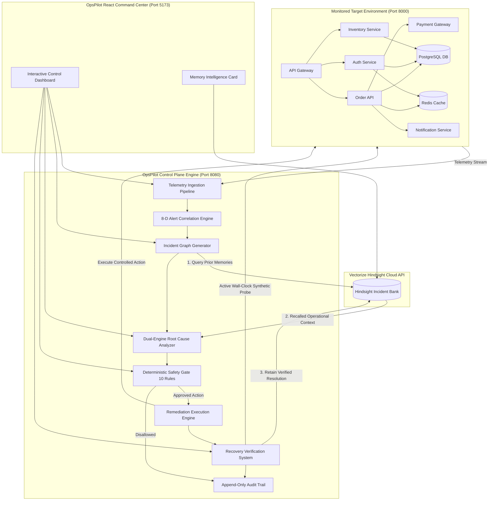
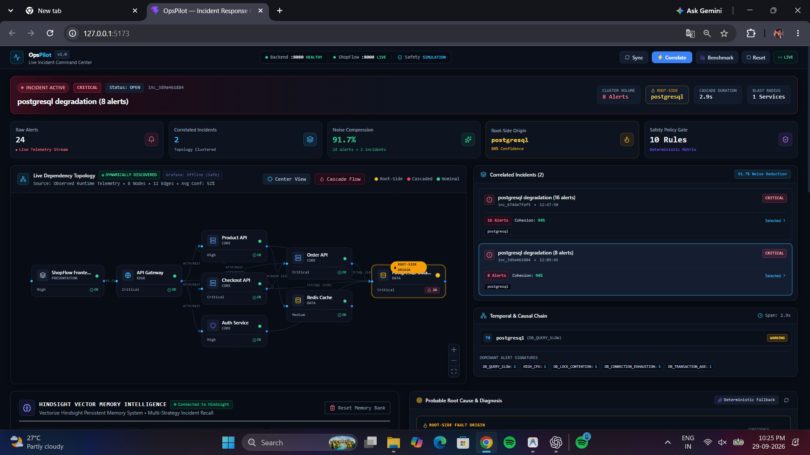
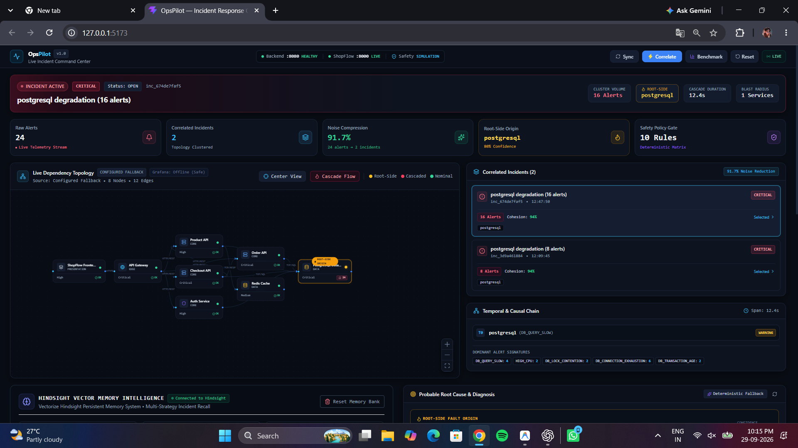
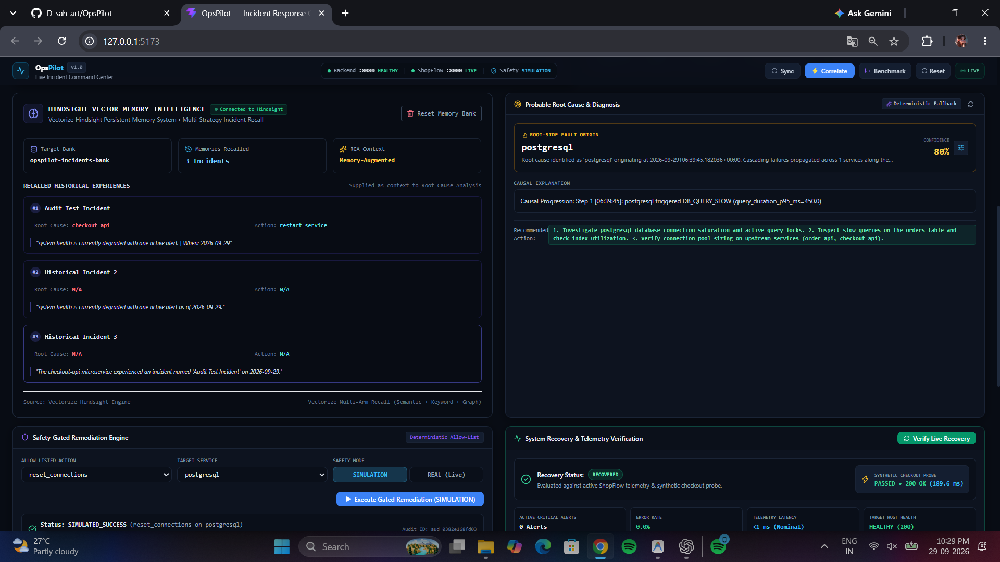
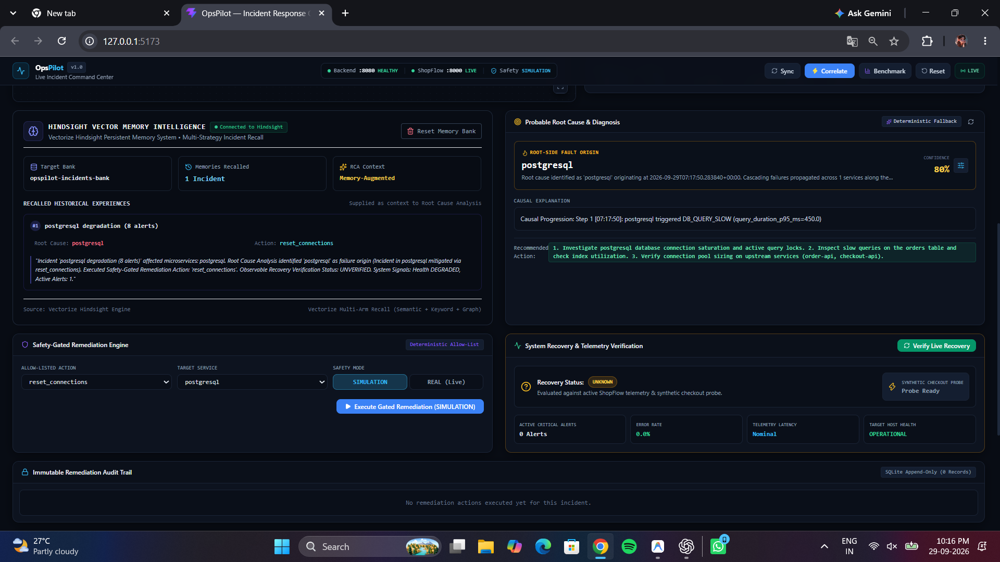
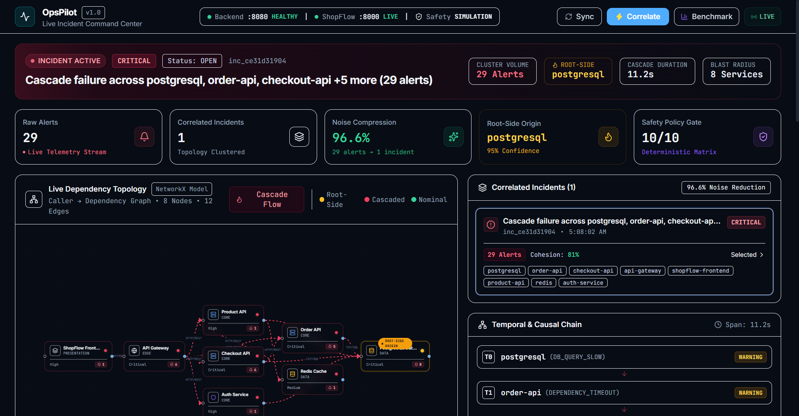
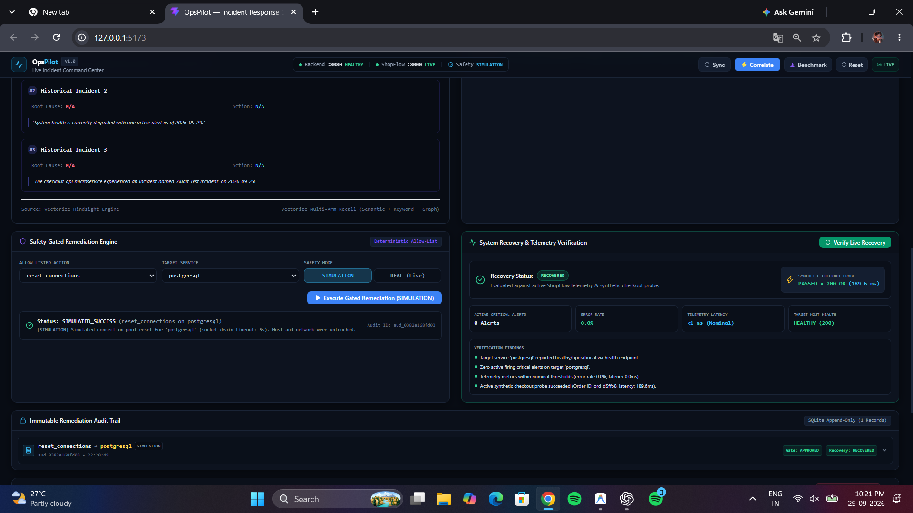

# OpsPilot

> Memory-powered autonomous AIOps platform that correlates cascading incidents, recalls prior operational experience with Vectorize Hindsight, performs root-cause analysis, applies safety-gated remediation, and verifies recovery.

---

## Problem

Modern microservice platforms suffer from severe operational fragility caused by asynchronous fault cascades. When a foundational infrastructure dependency (such as a shared relational database connection pool or key-value cache) degrades, failure propagates non-linearly across upstream service topologies, triggering an explosive avalanche of secondary alerts across dependent services (HTTP 500s, gateway timeouts, thread pool starvation, latency spikes).

On-call Site Reliability Engineers (SREs) face severe operational challenges:
- **Alert Fatigue:** A single root cause can trigger dozens of redundant alerts within seconds, obscuring the primary failure point.
- **Stateless AI Memory Loss:** Standard LLM-based troubleshooting bots operate statelessly—repeatedly rediscovering the exact same root causes and resolution steps for recurring operational incidents.
- **Unsafe Automated Remediation:** Naive remediation bots often execute unconstrained shell commands or trigger destructive restart loops without safety policy checks.
- **Lack of Verification:** Automated actions are frequently marked complete upon process exit without actively verifying that wall-clock user transactions are restored.

---

## Solution

OpsPilot provides a complete closed-loop autonomous incident resolution pipeline powered by **Vectorize Hindsight Persistent Memory**:

```
ShopFlow Telemetry Stream
       │
       ▼
Telemetry Ingestion Pipeline
       │
       ▼
Multidimensional Alert Correlation Engine (8-D Graph Affinity)
       │
       ▼
Unified Incident Creation
       │
       ▼
Vectorize Hindsight Memory Recall ──► Historical Operational Context
       │                                         │
       ▼                                         ▼
Root Cause Analysis (Dual-Engine Graph + LLM Grounding)
       │
       ▼
Deterministic Safety Gate (10 Immutable Rules)
       │
       ▼
Remediation Execution Engine (Allowlisted Primitives)
       │
       ▼
Independent Multi-Signal Recovery Verifier (Synthetic Checkout Probe)
       │
       ▼
Vectorize Hindsight Memory Retain ──► Long-Term Incident Bank
```

---

## Why Persistent Memory Matters

Stateless AIOps tools treat every incident as if it were the first time the failure ever occurred in system history. OpsPilot leverages **Vectorize Hindsight** as a central, persistent memory system to retain and recall past incident resolutions:

### Run 1 — Cold Memory Bank (First Encounter)
1. **Incident Trigger:** A PostgreSQL database connection pool leak causes secondary failures across dependent microservices.
2. **Correlation & RCA:** OpsPilot clusters 29 raw alerts into 1 unified incident graph. Because Hindsight memory is cold, `recalled_memories = 0`.
3. **Diagnosis & Remediation:** The Root Cause Analyzer diagnoses `postgresql` as the root cause with evidence-derived confidence and executes a safety-approved `reset_connections` remediation action.
4. **Recovery Verification:** The Recovery Verifier executes active synthetic checkout probes ($t_{probe} \approx 8.9\text{ ms}$) to confirm cluster recovery.
5. **Hindsight Retain:** Upon verified recovery, OpsPilot retains the complete incident resolution playbook into the Hindsight memory bank.

### Run 2 — Memory-Enhanced Incident Resolution (Subsequent Encounter)
1. **Incident Trigger:** A similar database cascade recurs in the target cluster.
2. **Hindsight Recall:** Prior to running Root Cause Analysis, OpsPilot queries Hindsight with the active incident context. Hindsight semantically recalls the previous resolution playbook.
3. **Context-Aware Diagnosis:** The recalled historical operational context is injected into the LLM prompt as supporting evidence alongside current live telemetry.
4. **Authoritative Principle:** Live real-time telemetry remains strictly authoritative—recalled memory provides historical operational context without overriding observed telemetry.

---

## Hindsight Integration

OpsPilot integrates directly with **Vectorize Hindsight Cloud**:

- **Official Cloud API Host:** `https://api.hindsight.vectorize.io`
- **Official Python Client:** `hindsight-client` (v0.10.1)
- **Default Bank Identifier:** `opspilot-incidents-bank`

### Core Integration Pattern
1. **Recall before RCA:** [`backend/app/root_cause/analyzer.py`](file:///c:/Users/bvr24/Downloads/OPSPILOT-main/OPSPILOT-main/backend/app/root_cause/analyzer.py) queries Hindsight memory banks using [`backend/app/memory/service.py`](file:///c:/Users/bvr24/Downloads/OPSPILOT-main/OPSPILOT-main/backend/app/memory/service.py) prior to executing RCA prompts.
2. **Context Injection:** Recalled memories are formatted by [`backend/app/root_cause/prompt_builder.py`](file:///c:/Users/bvr24/Downloads/OPSPILOT-main/OPSPILOT-main/backend/app/root_cause/prompt_builder.py) into prompt context.
3. **Retain after Recovery:** [`backend/app/remediation/service.py`](file:///c:/Users/bvr24/Downloads/OPSPILOT-main/OPSPILOT-main/backend/app/remediation/service.py) automatically retains incident resolution playbooks into Hindsight only after synthetic probes confirm 200 OK recovery.

### Key Implementation Files
- [`backend/app/memory/hindsight_client.py`](file:///c:/Users/bvr24/Downloads/OPSPILOT-main/OPSPILOT-main/backend/app/memory/hindsight_client.py): Direct wrapper for the Vectorize Hindsight Python SDK (`hindsight-client`).
- [`backend/app/memory/service.py`](file:///c:/Users/bvr24/Downloads/OPSPILOT-main/OPSPILOT-main/backend/app/memory/service.py): High-level retain, recall, bank reset, and status methods.
- [`backend/app/memory/models.py`](file:///c:/Users/bvr24/Downloads/OPSPILOT-main/OPSPILOT-main/backend/app/memory/models.py): Pydantic data schemas for memory items and recall results.
- [`backend/app/api/routes/hindsight_api.py`](file:///c:/Users/bvr24/Downloads/OPSPILOT-main/OPSPILOT-main/backend/app/api/routes/hindsight_api.py): Local REST simulation engine for offline fallback.

---

## Architecture



---

## Core Features

- **Multi-Modal Telemetry Ingestion:** Real-time collection and deduplication of metrics, structured JSON application logs, discrete system events, and alerts.
- **Topological Alert Correlation Engine:** 8-dimensional correlation vector scoring combining dependency graphs, shortest path distance, temporal proximity, and causal order to reduce noise.
- **Dynamic Topology Discovery:** Aggregates live application logs, alerts, health endpoints, and optional Grafana metrics into a NetworkX directed dependency graph with asymptotic confidence scoring ($50\% \to 99\%$).
- **Vectorize Hindsight Persistent Memory:** Semantic recall of historical incident resolutions before RCA, and automated retention after verified recovery.
- **Dual-Engine Root Cause Analysis:** Deterministic topological back-propagation combined with schema-grounded LLM analysis (with automatic fallback on timeout or validation failure).
- **10-Rule Deterministic Safety Gate:** Immutable policy engine enforcing allowlists, parameter bounds, deduplication windows, confidence floors, and simulation modes.
- **Allowlisted Action Handlers:** Secure execution primitives (`reset_connections`, `restart_service`, `clear_cache`) with zero raw shell command execution.
- **Independent Multi-Signal Recovery Verifier:** Executes wall-clock active synthetic checkout transactions ($t_{probe} \approx 8.9\text{ ms}$) against target clusters before incident resolution.
- **Append-Only Application Audit Trail:** Tamper-resistant compliance ledger recording all decisions, safety rule results, execution outputs, and verification latencies.
- **Interactive Command Center Console:** High-performance React + TypeScript UI featuring interactive topology graph canvas, live incident feed, memory intelligence metrics, and audit timeline.
- **ShopFlow Chaos Target Simulator:** High-fidelity e-commerce microservice platform with built-in chaos scenarios (PostgreSQL connection leak, Redis latency spike, Auth service degradation).

---

## Demo: Learning From Incidents

Follow this sequence to demonstrate Hindsight memory retention and recall:

### Step 1 — Fresh Memory Bank Setup
1. Open the OpsPilot Command Center UI at `http://127.0.0.1:5173`.
2. Locate the **Vectorize Hindsight Intelligence Card**.
3. Click **Reset Demo Bank** (or invoke `POST /api/memory/clear`) to start with an empty Hindsight memory bank.

### Step 2 — Run 1: First Incident Encounter
1. In ShopFlow, trigger the **PostgreSQL Connection Pool Exhaustion** chaos scenario.
2. In OpsPilot, click **Sync Telemetry**.
3. Click **Correlate Alerts** to cluster the 29 resulting alerts into a single incident graph.
4. Click **Run Root Cause Analysis**. Notice that **Recalled Memories = 0**.
5. Observe the RCA diagnosis correctly identifying `postgresql` as the root cause.
6. Click **Execute Remediation** (`reset_connections`).
7. Watch the **Independent Recovery Verifier** execute a synthetic checkout probe and verify HTTP 200 recovery.
8. The incident resolution is automatically retained into Hindsight Cloud (`retained: true`).

### Step 3 — Run 2: Similar Incident Recall
1. Reset ShopFlow target state to healthy.
2. Trigger the PostgreSQL Connection Pool scenario a second time.
3. In OpsPilot, click **Sync Telemetry**, **Correlate Alerts**, and **Run RCA**.
4. Observe the **Memory Intelligence Card**: **Recalled Memories > 0**.
5. Inspect the RCA prompt context—Hindsight's recalled resolution playbook is injected as supporting evidence alongside live telemetry.

---

## Tech Stack

| Layer | Technology | Purpose |
| :--- | :--- | :--- |
| **Backend Engine** | Python 3.10+ / FastAPI | Core control plane, REST API routes, and SSE event streaming |
| **Data & Graph Modeling** | SQLAlchemy / Pydantic V2 / NetworkX | Database ORM, typed schema validation, and topology graph analysis |
| **Frontend Console** | React 18 / TypeScript / Vite / Tailwind CSS | Responsive SRE command center dashboard |
| **Graph Visualization** | XYFlow (React Flow) | Interactive directed service topology canvas |
| **Persistent Memory** | Vectorize Hindsight (`hindsight-client` v0.10.1) | Vector persistent memory system for incident retain & recall |
| **Database** | SQLite (WAL mode) | Persistent storage for metrics, alerts, incidents, and audit trails |
| **Target Simulator** | ShopFlow (FastAPI microservices) | 8-service e-commerce platform target for chaos injection |
| **LLM Provider** | OpenAI / Gemini compatible endpoints | Natural language root-cause reasoning with schema guardrails |

---

## Repository Structure

```
OPSPILOT-main/
├── backend/
│   ├── app/
│   │   ├── api/routes/            # FastAPI REST & SSE endpoints
│   │   ├── correlation/           # 8-D alert correlation engine & scoring
│   │   ├── database/              # SQLite database session & ORM models
│   │   ├── memory/                # Vectorize Hindsight SDK & REST engine
│   │   ├── remediation/           # Safety gate policy & execution primitives
│   │   ├── root_cause/            # Dual-engine RCA & LLM grounding guardrails
│   │   └── topology/              # Dynamic discovery & graph algorithms
│   ├── config/                    # Remediation allowlists & topology specs
│   ├── tests/                     # Pytest suite (80 unit & integration tests)
│   └── requirements.txt           # Backend Python dependencies
├── frontend/
│   ├── src/
│   │   ├── api/                   # Typed REST API client
│   │   ├── components/            # UI components (Topology, Memory, Audit)
│   │   ├── context/               # OpsPilot application state context
│   │   └── App.tsx                # Main dashboard entry
│   ├── package.json               # Node.js dependencies
│   └── vite.config.ts             # Vite build configuration
├── shopflow-test/
│   ├── services/                  # ShopFlow microservices (Gateway, Auth, Order, etc.)
│   ├── chaos/                     # Failure injection engine & scenarios
│   ├── tests/                     # Pytest suite (26 ShopFlow integration tests)
│   └── requirements.txt           # Target simulator dependencies
├── docs/
│   └── screenshots/               # Application UI screenshots
├── .env.example                   # Global environment template
├── .gitignore                     # Git ignore policy (excludes .env & databases)
└── README.md                      # Primary project documentation
```

---

## Getting Started

### Prerequisites
- **Python 3.10+**
- **Node.js 18+** and **npm**
- **Vectorize Hindsight Account & API Key** (Get key at [https://hindsight.vectorize.io/](https://hindsight.vectorize.io/))

### 1. Clone Repository
```bash
git clone https://github.com/YOUR_USERNAME/opspilot.git
cd opspilot
```

### 2. Install Python Dependencies
```bash
python -m pip install -r backend/requirements.txt
python -m pip install -r shopflow-test/requirements.txt
```

### 3. Install Frontend Dependencies
```bash
cd frontend
npm install
cd ..
```

### 4. Configure Environment Variables
Copy `.env.example` to your local `.env` file (and/or `backend/.env`):
```bash
cp .env.example .env
```

Configure your local `.env` file with your Vectorize Hindsight Cloud credentials:
```env
HINDSIGHT_BASE_URL=https://api.hindsight.vectorize.io
HINDSIGHT_API_KEY=your_vectorize_hindsight_api_key_here
HINDSIGHT_BANK_ID=opspilot-incidents-bank
HINDSIGHT_ENABLED=true
```

> **Security Note:** The `.env` file is excluded from Git via `.gitignore` to prevent credential exposure.

---

## Running OpsPilot

Start the three core components in separate terminal windows:

### Terminal 1 — ShopFlow Target Microservices (Port 8000)
```bash
cd shopflow-test
python -m uvicorn services.api_gateway.main:app --port 8000 --host 127.0.0.1
```

### Terminal 2 — OpsPilot Backend Control Plane (Port 8080)
```bash
cd backend
python -m uvicorn app.main:app --port 8080 --host 127.0.0.1
```

### Terminal 3 — OpsPilot Frontend Command Center (Port 5173)
```bash
cd frontend
npm run dev
```

### Service Access URLs
- **OpsPilot Command Center UI:** `http://127.0.0.1:5173`
- **OpsPilot Backend OpenAPI Docs:** `http://127.0.0.1:8080/docs`
- **ShopFlow Target API Gateway:** `http://127.0.0.1:8000`

---

## Environment Variables

| Variable | Required | Default / Description |
| :--- | :--- | :--- |
| `APP_NAME` | No | `OpsPilot` |
| `ENVIRONMENT` | No | `development` |
| `PORT` | No | `8080` (Backend control plane port) |
| `SHOPFLOW_BASE_URL` | Yes | `http://127.0.0.1:8000` (Monitored target address) |
| `DATABASE_URL` | No | `sqlite:///./opspilot.db` (Local SQLite store) |
| `HINDSIGHT_BASE_URL` | Yes | `https://api.hindsight.vectorize.io` (Hindsight API host) |
| `HINDSIGHT_API_KEY` | Yes | Your Vectorize Hindsight Cloud API key |
| `HINDSIGHT_BANK_ID` | Yes | `opspilot-incidents-bank` (Target memory bank) |
| `HINDSIGHT_ENABLED` | Yes | `true` (Enable persistent memory integration) |
| `LLM_API_KEY` | Optional | OpenAI/Gemini API key for LLM-based RCA |
| `LLM_MODEL` | Optional | `gpt-4o-mini` (Model name for LLM RCA) |
| `REMEDIATION_ENABLED` | Yes | `true` (Enable remediation execution) |
| `REMEDIATION_SIMULATION_MODE` | No | `true` (Enable safe simulation mode for test runs) |

---

## Testing

OpsPilot includes a complete end-to-end automated test suite spanning backend algorithms, database persistence, memory integration, safety gates, and microservice chaos simulation:

### Execute Complete Pytest Suite
```bash
python -m pytest backend/tests/ shopflow-test/tests/ -v
```
**Test Result:** **106 passed / 106 tests green (100% pass rate)**.

### Execute Frontend Production Build Validation
```bash
cd frontend
npm run build
```
**Build Result:** **SUCCESS** (`dist/` bundle created cleanly in ~2.3 seconds).

---

## Security and Safety

- **Safety Gate Authorization:** All remediation commands must pass an immutable 10-rule safety evaluation before execution.
- **Strict Allowlisting:** Only predefined target services and typed primitive operations (`reset_connections`, `restart_service`, `clear_cache`) are permitted.
- **Zero Raw Shell Access:** OpsPilot never passes unconstrained shell input strings to subprocesses.
- **Authoritative Telemetry:** Recalled historical memories provide context but never override observed real-time cluster telemetry.
- **Credential Protection:** API keys reside strictly in server-side local `.env` files ignored by Git.

---

## Screenshots

### OpsPilot Dashboard


OpsPilot live incident command center showing service topology, telemetry, correlated incidents, and operational safety status.

### Cascading Incident Correlation


A PostgreSQL degradation produces a telemetry alert storm that OpsPilot correlates into a smaller set of root-cause-focused incidents.

### Run 1 — No Historical Memory


A fresh Hindsight memory bank starts with no relevant historical incidents. OpsPilot performs RCA using current telemetry and later retains the verified resolution.

### Run 2 — Hindsight Recall


On a later similar incident, OpsPilot recalls the previous PostgreSQL failure and supplies that operational experience as supporting RCA context.

### Safety-Gated Remediation


OpsPilot selects an allowlisted PostgreSQL remediation through its safety-gated execution workflow.

### Verified Recovery


OpsPilot verifies recovery using live health signals and a synthetic checkout probe, then records the approved remediation in the audit trail.

---

## Limitations

- **Simulated Microservice Environment:** Evaluated primarily against the 8-service ShopFlow target platform.
- **Scoped Action Allowlist:** Automated remediation primitives are limited to connection resets, service restarts, cache clears, and scaling primitives.
- **External Dependency:** Memory recall depends on network connectivity to Vectorize Hindsight Cloud API (with embedded local REST fallback when offline).

---

## Future Improvements

- **Kubernetes Native Controller:** Custom Resource Definitions (CRDs) and Operator deployment for production Kubernetes clusters.
- **Prometheus & OpenTelemetry Connectors:** Direct OTLP gRPC telemetry ingestion pipeline.
- **Multi-Tenant Memory Banks:** Environment-isolated memory banks for staging vs production clusters.
- **Interactive Human Approval Workflow:** Slack / Teams webhooks for manual SRE sign-off on low-confidence remediation proposals.

---

## Team

| Name | Role |
| :--- | :--- |
| **[Member 1]** | Lead Backend Engineer & AIOps Systems Architect |
| **[Member 2]** | Full-Stack Developer & Hindsight Memory Integration |
| **[Member 3]** | Site Reliability Engineer & Microservices Lead |

---

## Credits & Attribution

- **Vectorize Hindsight:** Persistent memory system for AI agents.  
  GitHub: [https://github.com/vectorize-io/hindsight](https://github.com/vectorize-io/hindsight)  
  Documentation: [https://hindsight.vectorize.io/](https://hindsight.vectorize.io/)

---

### License
This project is licensed under the MIT License - see the [LICENSE](file:///c:/Users/bvr24/Downloads/OPSPILOT-main/OPSPILOT-main/LICENSE) file for details.
